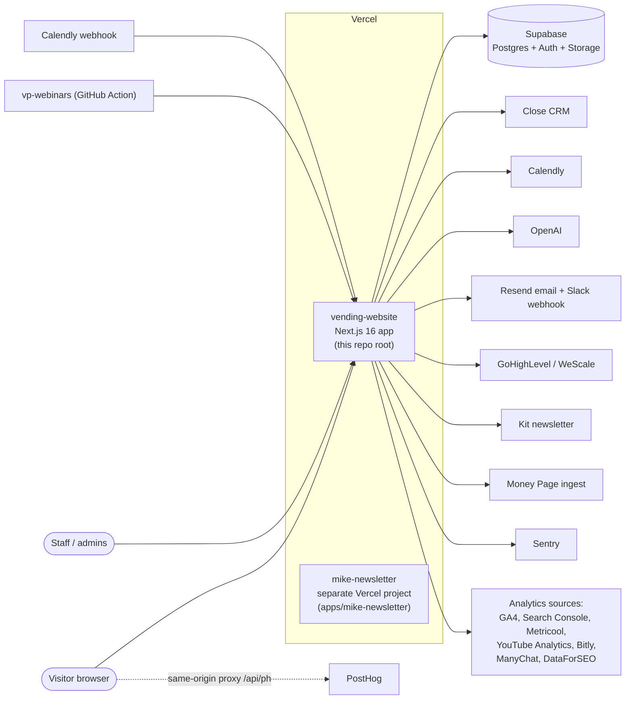
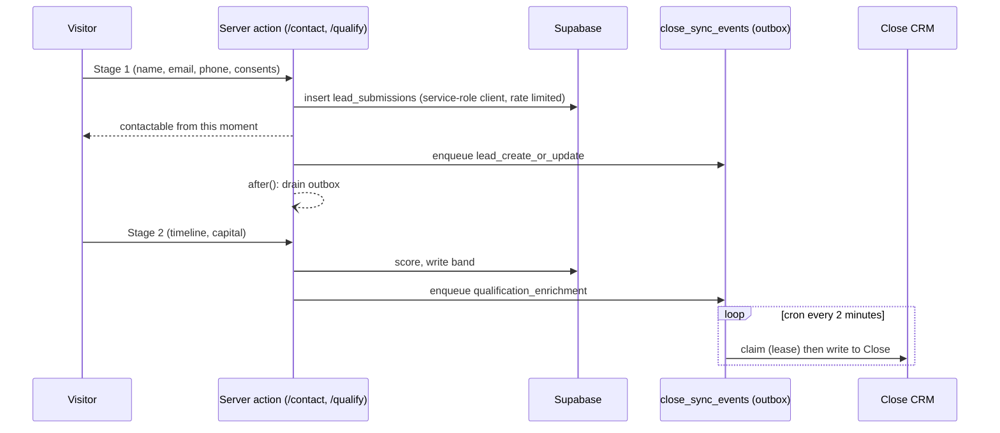
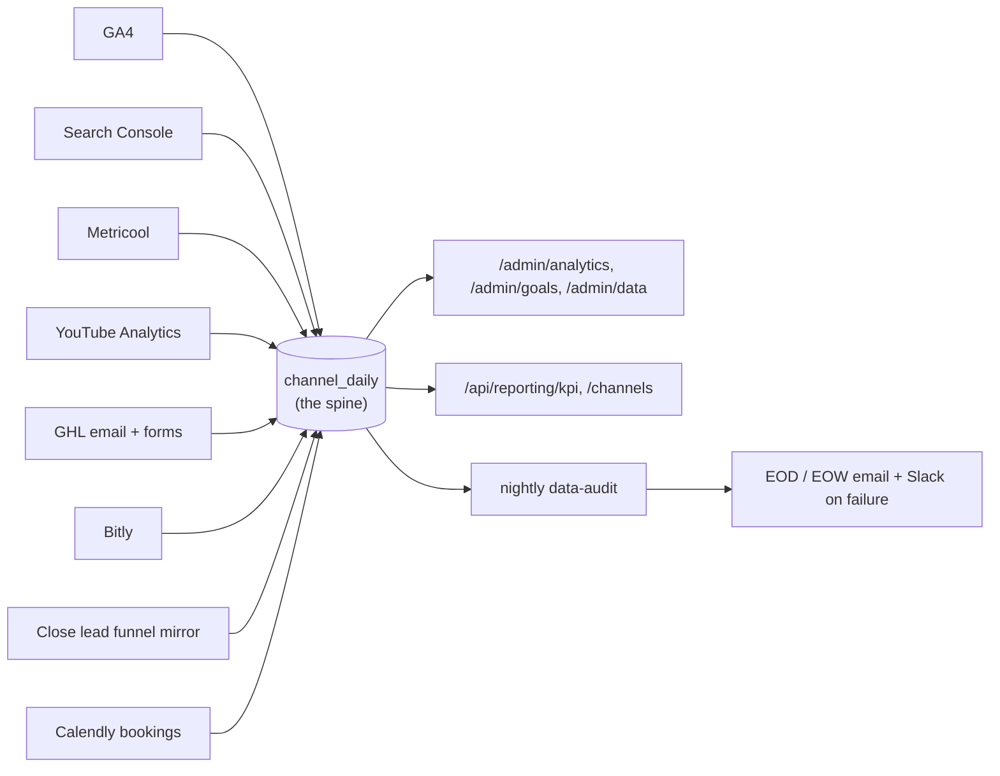

# Architecture

Verified against the code at `main` on 2026-10-02 (commit `faac091`). Where a statement
depends on something that lives outside this repository (Vercel project settings, the
production Supabase database, Close configuration) it says so. Routes come from
`src/app/api`, crons from `vercel.json`, environment variables from `src/lib/config.ts` and a
`process.env` scan; see [ENV.md](ENV.md), [RUNBOOK.md](RUNBOOK.md) and
[SECURITY.md](SECURITY.md) for the operational side.

## 1. System context

- **One production app.** `vendingpreneurs.com` and `www.vendingpreneurs.com` are served by the
  Vercel project that builds this repository root. Pushes to `main` publish to production
  (`vercel.json`: `git.deploymentEnabled.main = true`).
- **A second, unrelated Vercel project** builds `apps/mike-newsletter` (Root Directory
  `apps/mike-newsletter`). It has no Supabase, Close, Sentry or cron; it posts signups to
  ActiveCampaign. See `apps/mike-newsletter/README.md`. The root `tsconfig.json` excludes
  `apps`.
- **Supabase** holds all application data, admin authentication, and media storage. Migrations
  are applied by hand; see [DATABASE.md](DATABASE.md).
- **PostHog** traffic goes through a same-origin reverse proxy at `/api/ph/*`
  (`next.config.ts`), so there is no PostHog host variable.
- **Sentry** is wired through `src/instrumentation.ts`, `src/sentry.server.config.ts`,
  `src/sentry.edge.config.ts` and `src/instrumentation-client.ts`. It initialises only when a
  DSN is set, with `sendDefaultPii: false` and a scrubber for email/phone/name URL params
  (`src/lib/tracking/sentry-scrub.ts`).

## 2. Code layout

| Path                                                                                 | What it is                                                                                   | Kind     |
| ------------------------------------------------------------------------------------ | -------------------------------------------------------------------------------------------- | -------- |
| `src/app/`                                                                           | App Router pages and route handlers                                                          | runtime  |
| `src/app/admin/`                                                                     | Admin studio: pages, news, leads, bookings, chatbot, analytics, SEO, settings                | runtime  |
| `src/app/api/`                                                                       | 36 route handlers (section 5)                                                                | runtime  |
| `src/app/(builder-pages)/`                                                           | Pages authored in the SEO page builder, served from `seo_pages`                              | runtime  |
| `src/proxy.ts`                                                                       | Next 16 proxy (the old middleware): redirects, 404 rewrites, admin gate. Not `middleware.ts` | runtime  |
| `src/lib/services/`                                                                  | Most business logic: lead intake, analytics, channel spine, SEO, chatbot admin               | runtime  |
| `src/lib/close/`                                                                     | Close client, sync outbox runner, dedupe                                                     | runtime  |
| `src/lib/qualification/`                                                             | Scoring, bands, form fields, thank-you links                                                 | runtime  |
| `src/lib/chatbot/`                                                                   | Site chatbot: OpenAI turn handling, tools, booking attribution, learning pass                | runtime  |
| `src/lib/{ga4,bitly,metricool,youtube-analytics,search-console,dataforseo,ghl,kit}/` | One client per external system                                                               | runtime  |
| `src/components/`                                                                    | UI; `components/admin` follows the `--ui-*` tokens in `DESIGN.md`                            | runtime  |
| `supabase/migrations/`                                                               | ~100 SQL migrations plus `APPLY-IN-SQL-EDITOR.md`                                            | database |
| `data/`                                                                              | Case-study JSON and the YouTube registry, used by import scripts                             | data     |
| `scripts/`                                                                           | Operational and one-off scripts; see [scripts/README.md](../scripts/README.md)               | tooling  |
| `apps/mike-newsletter/`                                                              | Separate newsletter app (own Vercel project)                                                 | runtime  |
| `docs/`, `METRICS.md`, `REPORTING.md`                                                | Documentation; see [docs/README.md](README.md)                                               | docs     |
| `plans/`, `reports/`, `.claude/specs/`, `.agents/`, `evals/`                         | Agent run evidence, specs and tooling; not read at runtime                                   | history  |

## 3. Inbound data flows

### 3.1 Lead capture to Close

- The form is two-stage in one card; scoring lives in `src/lib/qualification/scoring.ts`
  (bands `0-30`, `31-45`, `46-75`, `76-100`). See the README "Key flows" for the three things
  that must change together when scoring changes.
- Close writes never happen in the request path. They are queued in `close_sync_events`
  and drained by `/api/admin/close-sync/run` every 2 minutes, and opportunistically by an
  `after()` hook on each submit stage. Events are claimed with a compare-and-swap on
  `attempt_count` plus a 5-minute lease (`CLAIM_LEASE_MINUTES` in `src/lib/close/sync.ts`), so
  overlapping drains are expected and safe.
- The outbox carries more than Close writes. Event types handled in `src/lib/close/sync.ts`
  are `lead_create_or_update`, `qualification_enrichment`, `newsletter_enrichment`,
  `stale_follow_up_task`, `manual_retry`, `warm_reply_activity`, the GHL forward
  (`GHL_FORWARD_EVENT_TYPE`) and `kit_subscribe`. The non-Close types are listed in
  `src/lib/close/event-types.ts`.
- Event status values are defined by the table check constraint (`supabase/migrations/20260617090000_post_submit_qualification.sql`), including `retrying`, `synced`, `failed`, `dead_letter`
  and `needs_review`; `max_attempts` defaults to 8.
- Side effects of a capture, each independent: Slack alert and Resend email
  (`src/lib/services/leads.ts`; each is skipped when its variable is unset), Money Page
  forward (`MONEY_PAGE_INGEST_URL`), GHL/WeScale forward (`src/lib/ghl/forward.ts`, controlled
  from `/admin/settings/lead-forwarding`), and Kit subscription for newsletter signups
  (`src/lib/kit/subscribe.ts`).
- Close custom fields are scoped to Lead or Contact objects; sending a contact-scoped id on a
  lead update makes Close reject the whole request. This caused three production incidents;
  see README "Close custom fields" and `AGENTS.md` Learnings.

### 3.2 Bookings

- `POST /api/webhooks/calendly` verifies Calendly's HMAC signature
  (`verifyCalendlySignature`, fail-closed when `CALENDLY_WEBHOOK_SIGNING_KEY` is unset), upserts
  `calendly_bookings` on `invitee_uri`, then attributes the booking to a chatbot conversation.
  Attribution errors are logged and never fail the webhook.
- `POST /api/chatbot/booked` is the embed's own confirmation. It re-reads the invitee from the
  Calendly API and accepts it only if the invitee's `utm_content` equals the conversation id.
- `/api/admin/chatbot-booking-reconcile/run` (daily) sweeps Calendly for bookings the webhook
  missed. `/api/admin/calendly-backfill/run` is a manual, month-at-a-time history backfill and
  is not scheduled.
- Every booked-on number reads `calendly_bookings.raw_payload -> payload -> created_at`; see
  `AGENTS.md` Learnings before adding a writer.

### 3.3 Site chatbot

Six public routes under `/api/chatbot/*` (`chat`, `config`, `history`, `lead`, `quick-action`,
`booked`) talk to OpenAI (`src/lib/chatbot/openai.ts`) and the `chatbot_*` tables. Each is
rate limited by `checkPublicRateLimit` except `config`. The learning pass
(`/api/admin/chatbot-learning/run`) and digest (`/api/admin/chatbot-digest/run`) run on cron.

### 3.4 Other ingest

- `POST /api/attribution/events`: first-party browser events (landing, popup, video progress,
  booking-session link). First-party check plus per-IP rate limit; it is not authenticated.
- `POST /api/admin/manychat-ingest` and `POST /api/admin/webinar-ingest`: bearer-secret
  receivers for ManyChat flows and the `vp-webinars` GitHub Action. They answer 503 when their
  secret is unset. Both reject bodies over a size cap (`MAX_BODY_BYTES`) before parsing.
- `POST /api/csp-report`: collector for the report-only CSP; writes nothing to the database.
- The masterclass funnel (`/masterclass*`) registers people through GHL; it uses
  `MASTERCLASS_SESSION_SECRET`, `GHL_WRITE_TOKEN` and the `WESCALE_GHL_*` variables.

## 4. Outbound analytics and the reporting spine

- Connectors run on cron (see the table in [RUNBOOK.md](RUNBOOK.md)) and record each run in
  `channel_sync_runs`. `channel_daily` is keyed on the six link dimensions only; `channel` is
  derived and overwritten on each upsert (`AGENTS.md` Learnings).
- The nightly audit (`/api/admin/data-audit/run`) compares stored numbers to the source
  systems and writes `data_audit_runs`; the daily and weekly reports email the verdict first
  (`docs/marketing/data-audit.md`). Every analytics tab shows a trust bar built from those runs
  (`src/lib/analytics/data-trust-bar.ts`).
- Metric definitions, file references and known gaps are in `METRICS.md`; the external reporting
  API contract is in `REPORTING.md` and `docs/marketing/reporting-api.md`.
- Won deals and revenue come from Close opportunities, never from `lead_submissions`
  (`src/lib/services/close-wins.ts`). Do not change how a metric is computed without reading
  the `AGENTS.md` Learnings entry for it.

## 5. Route inventory and authentication

Thirty-six route handlers exist under `src/app/api`. "Cron" means a `CRON_SECRET` bearer
(constant-time compare, 503 when the secret is unset, 401 on mismatch).

| Route                                             | Method | Auth                                           | Purpose                         |
| ------------------------------------------------- | ------ | ---------------------------------------------- | ------------------------------- |
| `/api/webhooks/calendly`                          | POST   | Calendly HMAC signature                        | Booking webhook                 |
| `/api/attribution/events`                         | POST   | First-party check + IP rate limit              | Browser attribution events      |
| `/api/csp-report`                                 | POST   | None (always 204; in-memory dedupe)            | CSP report-only collector       |
| `/api/chatbot/chat`                               | POST   | None; rate limit + daily cap                   | Chat turn                       |
| `/api/chatbot/config`                             | GET    | None                                           | Public widget config            |
| `/api/chatbot/history`                            | GET    | None; rate limit                               | Transcript rehydration          |
| `/api/chatbot/lead`                               | POST   | None; rate limit (IP + email)                  | Chat capture card               |
| `/api/chatbot/quick-action`                       | POST   | None; rate limit                               | Widget quick actions            |
| `/api/chatbot/booked`                             | POST   | None; rate limit; Calendly API re-check        | Embed booking confirmation      |
| `/api/reporting/kpi`                              | GET    | `REPORTING_API_KEY` bearer                     | Read-only KPI report (JSON/CSV) |
| `/api/reporting/channels`                         | GET    | `REPORTING_API_KEY` bearer                     | Read-only channel report        |
| `/api/page-builder/ai/chat`                       | POST   | Admin session, edit role, in-memory rate limit | Page-builder AI assistant       |
| `/api/admin/manychat-ingest`                      | POST   | `MANYCHAT_INGEST_SECRET` bearer                | ManyChat flow events            |
| `/api/admin/webinar-ingest`                       | POST   | `WEBINAR_INGEST_SECRET` bearer                 | Webinar snapshot push           |
| `/api/admin/<job>/run` (22 routes, section below) | GET    | Cron                                           | Scheduled and manual jobs       |

The 22 `run` routes are: `bitly-sync`, `calendly-backfill`, `channel-sync`,
`chatbot-booking-reconcile`, `chatbot-digest`, `chatbot-learning`, `close-lead-funnel-sync`,
`close-sync`, `data-audit`, `data-report`, `ga4-sync`, `ghl-sync`, `metricool-sync`,
`no-book-alert`, `pre-call-notes`, `qualification-lifecycle`, `scheduled-publishing`,
`search-console-sync`, `seo-ai`, `seo-ranks`, `seo-triggers`, `youtube-analytics-sync`. All
but `calendly-backfill` appear in `vercel.json`.

Despite the `/api/admin/` prefix, these routes do not use the admin session. The proxy admin
gate protects `/admin/*` pages; `/api/admin/*` is protected by the bearer secrets above.

### 5.1 Admin authentication layers

1. **Proxy** (`src/proxy.ts`): for `/admin/*` (except login and password-reset pages) a user
   with no Supabase session, or one not present in `app_users` with a recognised role, is
   redirected to `/admin/login`.
2. **Page and action checks**: every admin page and server action calls `requireAdmin()` /
   `requireSuperAdmin()` or the read-only equivalent itself, so a proxy bypass alone does not
   expose data (`src/lib/supabase/auth.ts`).
3. **Row-level security** on the database tables. The application's own server code uses the
   service-role client for most writes, so RLS is the backstop for direct Supabase access, not
   the primary gate for these routes.

Roles are `viewer` (read-only), `admin` and `super_admin` (`AdminRole` in
`src/lib/supabase/auth.ts`). Sign-in is Supabase email and password
(`signInWithPassword`), with a password-reset flow under `/admin/forgot-password`.

## 6. Rendering and routing notes

- `src/proxy.ts` owns trailing-slash 308s for public pages (Next's own redirect is switched off
  so the PostHog proxy can receive `/e/`, `/s/`, `/flags/`), legacy redirect tables, real 404
  status for missing public pages, and the admin gate. The contract in `AGENTS.md` Learnings
  (`curl -I /about/` is 308, `POST /api/ph/e/` is 200) must survive any matcher change.
- Builder pages render through `src/app/(builder-pages)/[...builderPath]`; redirects for them
  are emitted in the proxy, never from the page, because a redirect inside a streaming render
  degrades to a client-side meta tag.
- Security headers, including a report-only CSP, are set in `next.config.ts` from
  `src/lib/security-headers.ts`.

## 7. Where to read next

| Topic                          | Document                    |
| ------------------------------ | --------------------------- |
| Operating the system           | [RUNBOOK.md](RUNBOOK.md)    |
| Auth, PII, subprocessors       | [SECURITY.md](SECURITY.md)  |
| Environment variables          | [ENV.md](ENV.md)            |
| Database and migrations        | [DATABASE.md](DATABASE.md)  |
| Metric definitions             | `METRICS.md`                |
| External reporting API         | `REPORTING.md`              |
| Admin and builder UI contracts | `DESIGN.md`, `docs/design/` |
| Repo rules and learnings       | `AGENTS.md`                 |
