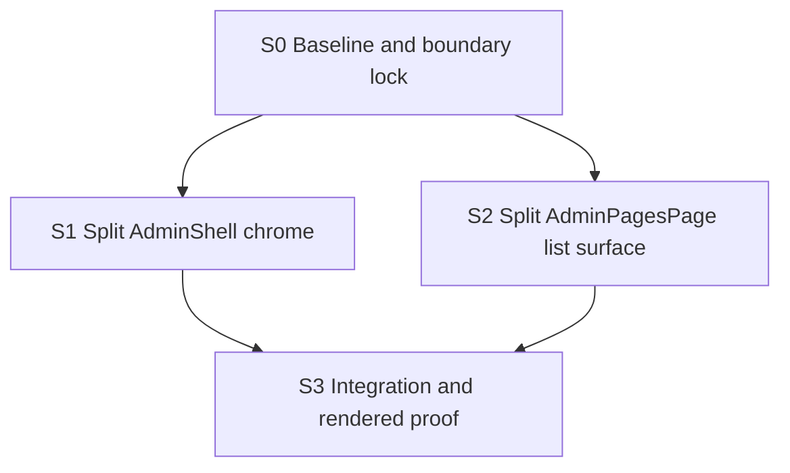

# React Doctor Admin Component Split Plan

Status: READY
Last updated: 2026-06-09

## Goal

Remove the two remaining React Doctor `no-giant-component` findings without changing admin page behavior:

- `src/components/admin/AdminShell.tsx:76` (`AdminShell`)
- `src/app/admin/pages/page.tsx:37` (`AdminPagesPage`)

The work is a behavior-preserving refactor. It should keep the existing delete/archive pending-state fix, server action form behavior, admin navigation contracts, SEO pages list semantics, and rendered admin UI intact.

## Evidence

- React Doctor currently scores 97/100 after the page action pending-state fix and reports only the two findings above.
- `npm run lint`, `npm run typecheck`, and `npm run test` passed after the pending-state fix.
- In-app Browser verification against localhost was attempted earlier, but direct URL navigation was blocked by browser policy even though the dev server logged `/admin/pages` as HTTP 200. The final proof gate must attempt fresh rendered verification again and must not mark screenshot proof as complete unless it actually succeeds.

## Risk Tier

Overall: T2.

Reasoning:

- No schema, migration, auth, permission, payment, or live data write changes are intended.
- Risk is concentrated in shared admin UI structure, React Server/Client Component boundaries, admin route layout behavior, and SEO pages list controls.
- `AdminShell` is shared across many `/admin` routes, so the refactor needs route-level visual proof, not code review alone.

## Source Contracts

- `AGENTS.md`
- `docs/design/admin-studio.md`
- `docs/design/page-builder.md`
- `docs/design/page-builder-blocks.md`
- `docs/design/visual-review-checklist.md`
- `node_modules/next/dist/docs/01-app/01-getting-started/05-server-and-client-components.md`
- `node_modules/next/dist/docs/01-app/01-getting-started/07-mutating-data.md`

## Existing Behavior To Preserve

- Admin shell:
  - Mobile navigation open/close behavior.
  - Desktop sidebar collapse/expand behavior and localStorage persistence.
  - Active section highlighting.
  - Account initials, role label, sign-out form, and immersive mode.
  - Header eyebrow, title, description, and action slot rendering.
- SEO pages list:
  - Search, status tabs, metadata workflow filters, sorting, pagination, page size, and href generation.
  - `returnTo` propagation for row and card actions.
  - Existing server action form submissions for duplicate, publish, draft, archive, and edit links.
  - Current pending labels and confirmation dialog behavior from the delete/archive fix.
  - Existing route-specific tests for no author column, governance persistence, and list-state helpers.
- Boundaries:
  - `src/lib/admin/seo-pages-list.ts` remains the canonical place for SEO pages list semantics.
  - Server actions are not rewritten as part of this refactor.
  - No new package dependencies.

## Graph

S1 and S2 are parallel-safe in principle because they touch separate primary files, but they both affect `/admin/pages` rendered proof. If one person is executing, do them serially and run S3 once at the end.

## S0: Baseline And Boundary Lock

Status: PENDING
Risk: T1
Dependencies: none
Parallel group: W0

Purpose:

- Reconfirm the two React Doctor findings are still the only target issues.
- Record the current dirty baseline so implementation does not accidentally revert the pending-state fix.
- Confirm all contract docs are still current before edits.

Expected writes:

- `plans/react-doctor-admin-component-split/progress.md`
- Optional worker notes under `plans/react-doctor-admin-component-split/agent-runs/`

Do not write:

- Product source files.
- Tests.
- Lockfiles.

RGR loop:

- Red: run React Doctor or the repo-approved React Doctor command and capture the two current findings.
- Green: no code green step; this node only locks scope.
- Refactor: none.

Exit gates:

- Current findings are documented.
- Current dirty files are identified and treated as baseline work to preserve.
- No new implementation scope is discovered.

## S1: Split AdminShell Chrome

Status: PENDING
Risk: T2
Dependencies: S0
Parallel group: W1-A

Purpose:

- Reduce the size and responsibility of `AdminShell` by extracting the mobile nav, desktop sidebar, nav list, account block, and header/content frame into focused components.
- Keep `AdminPageActionButton` behavior unchanged unless a compile or import boundary requires a minimal mechanical move.

Expected writes:

- `src/components/admin/AdminShell.tsx`
- Optional new files under `src/components/admin/admin-shell/`

Do not write:

- Admin route pages.
- Server actions.
- SEO pages list helpers.
- Migrations or lockfiles.

RGR loop:

- Red: confirm React Doctor flags `AdminShell` before this node changes source.
- Green: extract focused components while preserving the exported `AdminShell` API and existing class contracts.
- Refactor: remove only duplication or prop threading introduced by the extraction.

Acceptance:

- `AdminShell` keeps the same public props and export.
- Mobile nav, desktop nav, sidebar collapse, account/sign-out, active highlighting, and immersive layout continue to render.
- No route-specific behavior moves into shared shell components.
- React Doctor no longer flags `AdminShell`.

Verification:

- `npm run lint`
- `npm run typecheck`
- Focused tests if existing tests cover shell-visible behavior.
- Browser proof for at least `/admin/pages`, `/admin/media`, and an immersive editor route if available.

## S2: Split AdminPagesPage List Surface

Status: PENDING
Risk: T2
Dependencies: S0
Parallel group: W1-B

Purpose:

- Reduce the size and responsibility of `AdminPagesPage` by extracting summary, toolbar/filter controls, results table/card rendering, empty state, pagination, and footer into focused server-rendered components.
- Keep list-state and server action semantics in their current owners.

Expected writes:

- `src/app/admin/pages/page.tsx`
- Optional route-local components under `src/app/admin/pages/`

Do not write:

- `src/lib/admin/seo-pages-list.ts` except for type-only changes that prove necessary.
- Server actions except for type-only import adjustments that prove necessary.
- Shared shell components.
- Migrations or lockfiles.

RGR loop:

- Red: confirm React Doctor flags `AdminPagesPage` before this node changes source.
- Green: extract focused components while keeping `AdminPagesPage` responsible for data fetching and state construction.
- Refactor: remove prop duplication only when it does not hide list-state semantics.

Acceptance:

- `AdminPagesPage` still fetches the same data and builds the same list state.
- Search, filters, status tabs, sort, pagination, page size, row/card actions, status dots, and footer counts keep existing behavior.
- The page remains a Server Component unless there is a documented reason to introduce a client boundary.
- React Doctor no longer flags `AdminPagesPage`.

Verification:

- `npm run lint`
- `npm run typecheck`
- `npm run test -- src/app/admin/pages/page.test.ts src/app/admin/pages/actions.test.ts src/lib/admin/list-state.test.ts`
- Browser proof for `/admin/pages` at desktop and narrow widths.

## S3: Integration And Rendered Proof

Status: PENDING
Risk: T2
Dependencies: S1, S2
Parallel group: W2

Purpose:

- Prove the two refactors work together across the shared admin shell and SEO pages list surface.
- Verify the rendered UI with fresh browser evidence before calling the findings fixed.

Expected writes:

- `plans/react-doctor-admin-component-split/progress.md`
- Optional worker notes under `plans/react-doctor-admin-component-split/agent-runs/`

Do not write:

- New product source changes except narrow follow-up fixes required by failed gates.

RGR loop:

- Red: capture any failing route, test, typecheck, lint, or React Doctor output after S1/S2 integration.
- Green: apply the narrowest fix required to restore behavior.
- Refactor: none unless a verification failure proves an extraction boundary is wrong.

Acceptance:

- React Doctor no longer reports `no-giant-component` for `AdminShell` or `AdminPagesPage`.
- `npm run lint`, `npm run typecheck`, and relevant tests pass.
- Fresh rendered verification covers:
  - `/admin/pages`
  - `/admin/media`
  - `/admin/settings/users` or another settings route using the shell
  - `/admin/pages/new` or another immersive/editor route if reachable
- If Browser localhost navigation is blocked again, the exact blocker is documented and the browser proof gate remains blocked rather than silently downgraded.

## Out Of Scope

- Changing SEO pages business rules.
- Reworking server actions.
- Changing delete/archive semantics beyond preserving the current pending/confirmation fix.
- Visual redesign.
- New admin navigation IA.
- Package upgrades.
- Pushing branches, opening PRs, or triggering deployments.

## Open Questions

- None blocking. The assumed execution path is tracked implementation through the feature-orchestrator workflow.
